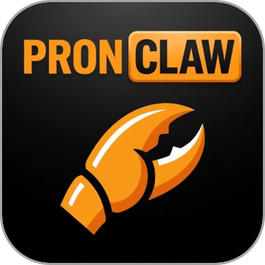

<p align="center">
  
</p>

<h1 align="center">PornClaw</h1>

<p align="center">
  <b>Smart Series Recommendation Engine for Adult Content Sites</b>
</p>

<p align="center">
  
  
  
  
  
</p>

---

PornClaw 是一个面向成人内容站点的**系列推荐引擎原型**。用户输入数据源 URL，系统自动抓取最近内容、聚合成系列，结合显式标签偏好、自然语言偏好和交互式反馈，输出**可解释的 Top 5 推荐**。

## Features

- **智能抓取** — 通过适配器接口抓取数据源，自动解析内容条目
- **标签标准化** — 多语言标签归一（中/英），统一映射到标准标签体系
- **系列聚合** — 将零散条目智能归并为系列，计算活跃度指标
- **自然语言偏好** — 支持自由文本描述偏好（如"最近一周，偏剧情，不要 dark"）
- **交互式反馈** — 候选反馈 + 推荐反馈双轮驱动，持续优化推荐
- **可解释推荐** — 每条推荐附带评分细项和中文理由说明
- **一键演示** — 内置 `demo://seed` 数据源，开箱即用

## Architecture

```
用户输入 URL + 标签偏好 + 自然语言偏好
  → Source Adapter 抓取最近条目
  → Normalize 清洗标题 / 标签
  → Aggregate 聚合为系列
  → 候选反馈补充用户画像
  → Recommend 多维度加权评分
  → Explain 生成推荐理由
  → 推荐结果页反馈 → 影响下一轮排序
```

### Scoring Model

| 维度 | 计算方式 | 权重 |
|------|---------|------|
| 新鲜度 | `5.0 - 0.5 × min(days_old, 10)` | 基础分 |
| 标签匹配 | 命中喜欢标签 / 不喜欢标签 | +2.5 / -4.0 |
| 反馈相似度 | 与已反馈系列的标签重合 | +1.5 / -2.0 |
| 活跃度 | `min(7d_updates, 5) × 0.8` | 加分 |
| 多样性 | 与已选系列的标签重叠惩罚 | -0.3 |

## Tech Stack

| Component | Technology |
|-----------|-----------|
| Web Framework | FastAPI 0.115 |
| Server | Uvicorn |
| ORM | SQLAlchemy 2.0 |
| Database | SQLite |
| Templating | Jinja2 |
| HTML Parsing | BeautifulSoup4 |
| Testing | pytest + httpx |
| Container | Docker Compose |

## Project Structure

```
pornclaw/
├── app/
│   ├── main.py              # FastAPI entry point
│   ├── config.py             # Configuration & tag mappings
│   ├── db.py                 # Database setup
│   ├── models/               # SQLAlchemy ORM models
│   ├── services/             # Core business logic
│   │   ├── ingest.py         #   Source crawling
│   │   ├── normalize.py      #   Tag normalization
│   │   ├── aggregate.py      #   Series grouping
│   │   ├── profile.py        #   User profile management
│   │   ├── recommend.py      #   Scoring & ranking
│   │   ├── explain.py        #   Reason text generation
│   │   └── preference_parser.py  # Free-text parsing
│   ├── adapters/             # Source adapter interface
│   ├── routes/               # HTTP endpoints
│   ├── templates/            # Jinja2 HTML templates
│   ├── static/               # CSS
│   └── utils/                # Utilities
├── tests/                    # Unit & integration tests
├── scripts/init_db.py        # DB initialization
├── requirements.txt
├── Dockerfile
└── docker-compose.yml
```

## Quick Start

### Local Development

```bash
cd pornclaw
python -m venv .venv
source .venv/bin/activate
pip install -r requirements.txt
python scripts/init_db.py
uvicorn app.main:app --reload
```

Open http://127.0.0.1:8000 — the homepage comes pre-filled with the demo source `demo://seed`.

### Docker

```bash
cd pornclaw
docker compose up --build
```

Visit http://127.0.0.1:8000.

### Run Tests

```bash
cd pornclaw
pytest
```

## API Endpoints

| Method | Path | Description |
|--------|------|-------------|
| `GET` | `/` | Homepage with preference form |
| `POST` | `/start` | Submit preferences & start pipeline |
| `GET` | `/candidate-feedback/{id}` | Candidate feedback page |
| `GET` | `/recommendations/{id}` | Top 5 recommendations |
| `POST` | `/source/ingest` | API: ingest source |
| `POST` | `/profile/create` | API: create/update profile |
| `POST` | `/recommend` | API: generate recommendations |
| `POST` | `/feedback` | API: submit feedback |

## Demo Source

默认使用 `demo://seed`，由 `DemoSourceAdapter` 读取内置静态 HTML 数据，内含 3 个演示系列：

- **Campus Hearts** — romance, school, drama, longform
- **Sky Tale** — fantasy, soft, longform
- **Dark Dungeon** — dark, action, explicit

同一适配器也支持解析外部 HTTP(S) URL 的 HTML 卡片结构。

## Roadmap

- [ ] 增加更多 Source Adapter（支持更多站点）
- [ ] 优化系列归并规则
- [ ] 引入 ML 模型替代规则评分
- [ ] 增加用户认证与会话持久化
- [ ] 多数据源融合推荐
- [ ] 更精细的多样性控制和召回策略

## License

MIT
